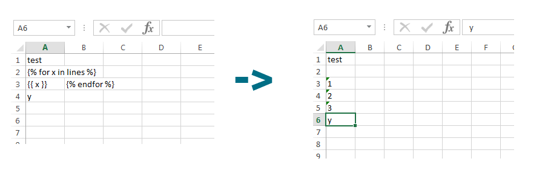

Working with document templates
===============================

Supported formats
-----------------

.. Important::
  The templates themselves **must** be in on of the OpenDocument formats: ``.odt``, ``.ods``, ``.odp`` or ``.odg``.

Templated-docs can generate documents in any format LibreOffice itself supports. For the moment they are:

**Text documents**: doc, docx, fodt, html, odt, ott, pdf, txt, xhtml, png

**Spreadsheets**: csv, fods, html, ods, ots, pdf, xhtml, xls, xlsx, png

**Presentations**: fodp, html, odg, odp, otp, pdf, potm, pot, pptx, pps, ppt, svg, swf, xhtml, png

**Drawings**: fodg, html, odg, pdf, svg, swf, xhtml, png

Where to put templates
----------------------

Templated-docs uses a standard Django template discovery mechanism, so you should place your documents at a path where other templates reside. Usually it's either a ``templates`` directory at the project level, or ``templates`` folders in each applications.

What subset of templating language is supported
-----------------------------------------------

Django templating language is fully supported, including filters and tags. Keep in mind, though, that in order to use custom template tags you should load them first using a standard ```` tag.

Looping
-------

Generating lines in loops is supported via the standard ```` tag. Here's the picture that illustrates the concept:

